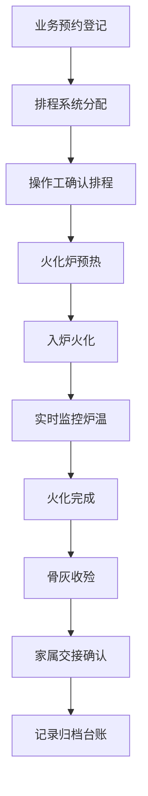
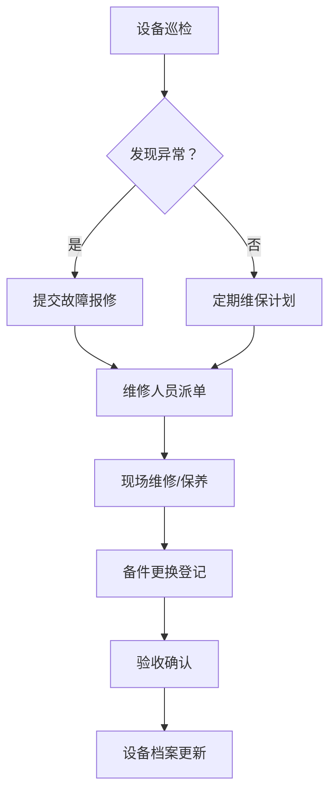

## 1. 产品概述

殡仪火化炉运行管理系统是面向殡仪馆火化车间的专业管理客户端软件，用于实现火化炉的全生命周期管理，涵盖排程调度、设备监控、能耗分析、环保监测等核心业务场景。

- **主要用途**：火化车间炉况管理、业务排程、能耗统计、设备维保、骨灰交接、环保监测、运行台账
- **目标用户**：火化车间主任、操作工、设备维护人员、环保管理员、后勤管理人员
- **核心价值**：提高火化效率、降低运营成本、确保环保达标、实现全程可追溯

---

## 2. 核心功能

### 2.1 用户角色

| 角色 | 注册方式 | 核心权限 |
|------|----------|----------|
| 系统管理员 | 后台创建 | 用户管理、系统配置、数据导出 |
| 车间主任 | 后台创建 | 排程管理、数据统计、报表查看、维保审批 |
| 操作工 | 后台创建 | 炉况操作、排程查看、骨灰交接、运行记录 |
| 设备维护员 | 后台创建 | 设备维保、故障报修、备件更换 |
| 环保管理员 | 后台创建 | 环保监测、达标记录、数据上报 |

### 2.2 功能模块

1. **火化排程**：火化业务排程、操作工排班、队列管理
2. **炉况监控**：炉膛温度实时监控、设备状态监测、异常报警
3. **能耗统计**：燃料消耗记录、能耗分析、单炉运行时长统计
4. **设备维保**：炉体维护保养、设备故障报修、备件更换管理
5. **骨灰交接**：骨灰收殓、交接登记、家属确认
6. **环保监测**：烟气排放实时监测、环保达标记录、数据报表
7. **运行台账**：综合查询、历史记录、数据导出、统计分析

### 2.3 页面详情

| 页面名称 | 模块名称 | 功能描述 |
|----------|----------|----------|
| 工作台首页 | 数据概览 | 今日火化数量、在炉数量、待处理任务、能耗概览、设备状态 |
| 火化排程 | 排程管理 | 排程日历、新增排程、排程状态、操作工排班表 |
| 炉况监控 | 实时监控 | 炉膛温度曲线图、设备状态面板、运行参数、异常告警 |
| 能耗统计 | 能耗分析 | 燃料消耗记录、能耗对比图表、单炉能耗排行、能耗趋势 |
| 设备维保 | 维保管理 | 维保计划、故障报修单、备件更换记录、设备档案 |
| 骨灰交接 | 交接管理 | 骨灰收殓登记、交接记录、家属确认、历史查询 |
| 环保监测 | 环保数据 | 烟气排放监测、达标记录、环保报表、超标告警 |
| 运行台账 | 台账查询 | 综合查询、历史记录、高级筛选、数据导出 |

---

## 3. 核心流程

### 3.1 火化业务流程

### 3.2 设备维保流程

---

## 4. 用户界面设计

### 4.1 设计风格

- **设计方向**：工业/专业风格，庄重沉稳，符合殡仪场所的特殊性
- **主色调**：深灰蓝色 (#1E3A5F) - 专业、稳重
- **辅助色**：深蓝色 (#2563EB) - 交互、强调；深灰色 (#374151) - 文字；浅灰色 (#F3F4F6) - 背景
- **状态色**：绿色 (#10B981) 正常；红色 (#EF4444) 异常/报警；黄色 (#F59E0B) 警告/进行中
- **字体**：标题使用思源宋体（庄重感），正文使用思源黑体（可读性）
- **按钮风格**：直角或微圆角，扁平设计，带悬停和点击反馈
- **布局风格**：侧边导航 + 顶部状态栏 + 主内容区卡片式布局
- **图标风格**：线性图标，简约专业，避免过于活泼的设计

### 4.2 页面设计概览

| 页面名称 | 模块名称 | UI 元素 |
|----------|----------|---------|
| 工作台 | 数据概览 | 统计卡片、实时状态面板、快捷操作区、今日日程、告警列表 |
| 火化排程 | 排程管理 | 日历视图、时间轴、排程卡片、排班表格、新增弹窗 |
| 炉况监控 | 实时监控 | 温度曲线图、设备状态仪表盘、参数列表、告警横幅 |
| 能耗统计 | 数据分析 | 柱状图、折线图、饼图、数据表格、筛选条件 |
| 设备维保 | 维保管理 | 工单列表、维保日历、设备卡片、备件台账 |
| 骨灰交接 | 交接管理 | 交接列表、详情弹窗、确认按钮、打印预览 |
| 环保监测 | 数据监测 | 实时数据面板、趋势图、达标率统计、报表导出 |
| 运行台账 | 数据查询 | 高级筛选栏、数据表格、分页、导出按钮 |

### 4.3 响应式设计

- **设计原则**：桌面优先，兼顾大屏展示（监控大屏模式）
- **桌面端**：完整功能，侧边栏导航，多列布局
- **监控大屏**：隐藏导航，全屏展示关键数据和图表
- **触控优化**：按钮最小尺寸 44px，支持触控操作

---

## 5. 数据安全与隐私

- 所有操作留痕，支持审计追踪
- 逝者信息加密存储，严格权限控制
- 敏感操作需二次确认
- 数据定期备份，支持灾难恢复
