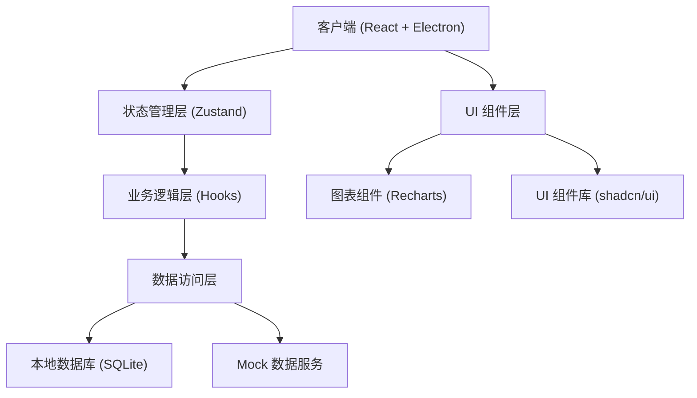
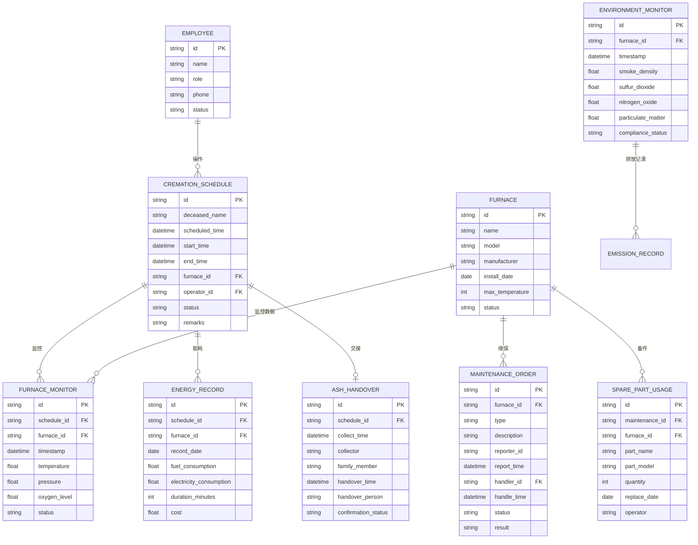

## 1. 架构设计



---

## 2. 技术描述

### 2.1 技术栈选型

| 层级 | 技术选型 | 版本 | 说明 |
|------|----------|------|------|
| 前端框架 | React | 18.x | 组件化开发 |
| 构建工具 | Vite | 5.x | 快速构建与热更新 |
| 类型系统 | TypeScript | 5.x | 类型安全 |
| 状态管理 | Zustand | 4.x | 轻量级状态管理 |
| UI 框架 | TailwindCSS | 3.x | 原子化 CSS |
| UI 组件 | shadcn/ui | - | 高质量组件库 |
| 图表库 | Recharts | 2.x | 数据可视化 |
| 日期处理 | date-fns | 3.x | 日期时间处理 |
| 图标 | Lucide React | - | 线性图标库 |
| 桌面端 | Electron | 28.x | 打包为桌面客户端 |
| 本地数据库 | better-sqlite3 | - | 本地数据持久化 |

### 2.2 目录结构

```
src/
├── assets/          # 静态资源
├── components/      # 通用组件
│   ├── ui/         # shadcn 组件
│   ├── layout/     # 布局组件
│   └── charts/     # 图表组件
├── pages/           # 页面组件
│   ├── dashboard/
│   ├── schedule/
│   ├── monitor/
│   ├── energy/
│   ├── maintenance/
│   ├── handover/
│   ├── environment/
│   └── ledger/
├── store/           # 状态管理
├── hooks/           # 自定义 Hooks
├── types/           # TypeScript 类型定义
├── utils/           # 工具函数
├── data/            # Mock 数据
├── lib/             # 第三方库封装
└── App.tsx          # 应用入口
```

---

## 3. 路由定义

| 路由 | 页面 | 说明 |
|------|------|------|
| `/` | 工作台首页 | 数据概览与快捷操作 |
| `/schedule` | 火化排程 | 排程管理与排班 |
| `/monitor` | 炉况监控 | 实时监控与告警 |
| `/energy` | 能耗统计 | 能耗分析与报表 |
| `/maintenance` | 设备维保 | 维保与故障管理 |
| `/handover` | 骨灰交接 | 交接管理与确认 |
| `/environment` | 环保监测 | 环保数据与达标 |
| `/ledger` | 运行台账 | 综合查询与导出 |

---

## 4. 数据模型

### 4.1 ER 图



### 4.2 Mock 数据

系统将提供完整的 Mock 数据，包括：
- 3-5 台火化炉设备档案
- 最近 30 天的火化排程记录（每天 5-10 条）
- 实时温度监控模拟数据
- 能耗统计数据（最近 90 天）
- 设备维保记录（最近 3 个月）
- 骨灰交接记录
- 环保监测历史数据
- 员工信息数据
